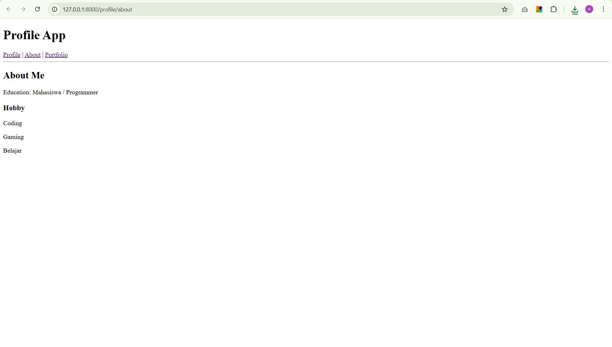
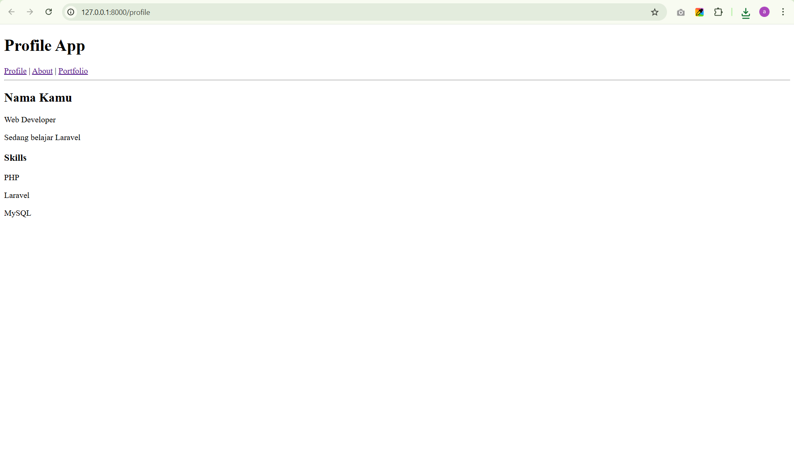
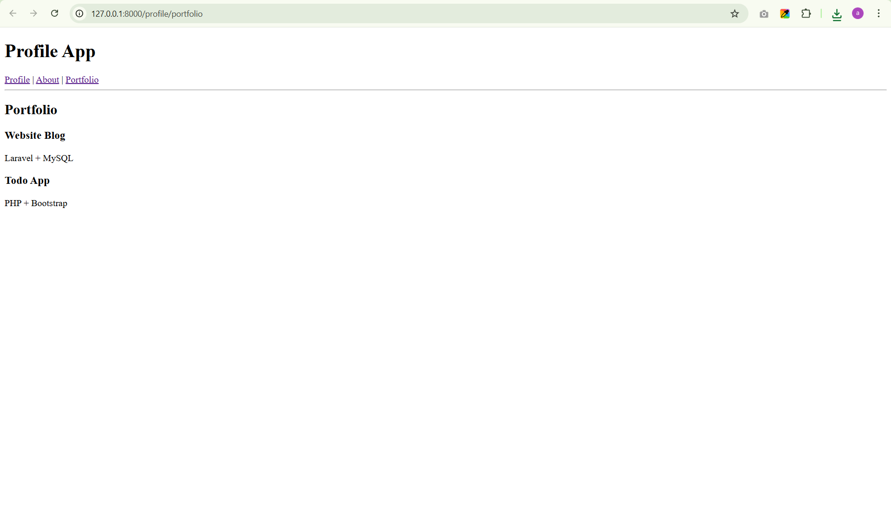

# Belajar Laravel

Project ini adalah latihan belajar Laravel framework.

## Fitur yang dipelajari

- Laravel routing
- Controller
- Blade view
- MVC concept
- Basic project structure

## Cara menjalankan project

Clone repository

```bash
git clone https://github.com/username/belajar_laravel.git
```

Masuk ke folder project

```bash
cd belajar_laravel
```

Install dependency

```bash
composer install
```

Copy environment file

```bash
cp .env.example .env
```

Generate app key

```bash
php artisan key:generate
```

Jalankan server

```bash
php artisan serve
```

Buka di browser

```
http://127.0.0.1:8000
```

---

## Teknologi yang digunakan

- PHP
- Laravel
- Composer
- Blade Template

---

## Tujuan project

Project ini dibuat untuk mempelajari dasar framework Laravel seperti routing, controller, dan view.

## Screenshot

### About Me


### Profile Page


### Portfolio
